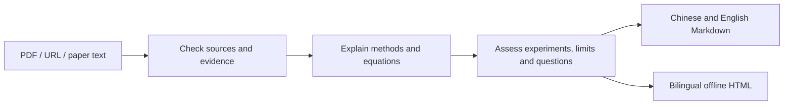

<div align="center">

# Anime Paper Deep Reading

### Read the paper. See how it works.

Turn research papers into source-grounded notes and explorable explanations.  
Chinese & English · Interactive methods · Professional LaTeX · Offline HTML

[](SKILL.md) [](README.md) [](REFERENCE.md) [](templates/anime_report_template.html)

[简体中文](README.md) · **English**

[Features](#features) · [Showcase](#showcase) · [Quick start](#quick-start) · [Workflow](#workflow) · [Contributing](#contributing)

</div>


## Why this skill

The difficult parts of a paper often lie in its equations, computational dependencies and experimental conditions. A summary alone rarely explains them.

**Anime Paper Deep Reading** is a Codex skill that checks sources, explains mechanisms and assesses evidence. It turns suitable methods into step-through diagrams and mathematical relationships into parameter explorations, while retaining complete Markdown for research discussions and review.

The visual style uses an ivory paper background, teal emphasis and copper accents. Motion explains changes; readers can pause, scrub or use static mode.

## Features

| Capability | Reading experience |
| --- | --- |
| **Deep reading** | Context, problem, contributions, methods, experiments, limitations and eight research questions |
| **Bilingual reports** | Switch text, captions and controls while preserving reading and interaction state |
| **Method diagrams** | Select modules, play steps or scrub through computational dependencies |
| **Parameter exploration** | Change suitable mathematical or algorithmic inputs and inspect their consequences |
| **Evidence comparison** | Explore reported configurations with exact values, conditions and sources |
| **Professional mathematics** | Require rendered LaTeX, including matrices, cases and aligned derivations |
| **Offline delivery** | Chinese/English Markdown plus self-contained interactive HTML |
| **Natural writing** | Explain judgments with concrete mechanisms, data and conditions |

## Showcase

These screenshots come from an earlier Transformer report. The attention example uses manually specified 2D vectors, **not the paper’s trained weights**. Screenshots predate the latest LaTeX requirement; the current specification governs mathematical rendering.

### A focused reading page


### Step through the method

Select encoder/decoder modules and control explanations with play, pause and scrubbing.


### Explore the calculation

Choose a query, switch illustrative heads and toggle causal masking to inspect attention weights and output.


Interactions adapt to the paper: geometry can explore distance, optimization can explain steps, and theory can expose conditions and proof dependencies.

## Quick start

### 1. Install

Place the full repository in your Codex user skills directory, named `anime-paper-deep-reading`. The default is `~/.codex/skills`; when `CODEX_HOME` is set, use its `skills` directory.

**Windows PowerShell**

```powershell
git clone https://github.com/wellord724/anime-paper-deep-reading.git "$env:USERPROFILE\.codex\skills\anime-paper-deep-reading"
```

**macOS / Linux**

```sh
git clone https://github.com/wellord724/anime-paper-deep-reading.git ~/.codex/skills/anime-paper-deep-reading
```

You can also give the repository URL to your agent and ask it to install the skill.

Use these commands when the destination does not yet exist. Preserve local changes before updating an existing installation. A private repository requires authorized GitHub access. Reload skills or start a new Codex session after installation.

### 2. Provide a paper

Attach a PDF, provide a URL, or give an unambiguous title:

```text
$anime-paper-deep-reading Read Attention Is All You Need in depth and generate bilingual notes and an offline interactive report.
```

Specify focus areas when useful:

```text
$anime-paper-deep-reading Focus on the equations, ablations and reproduction details of this paper.
```

### 3. Read and explore

```text
paper_report.zh.md   Chinese reading notes
paper_report.en.md   English reading notes
paper_report.html    Bilingual offline interactive report
```

Open the HTML file in a browser. Explicit language, length and format preferences take precedence over the defaults.

## Workflow



- Distinguish author claims, source evidence and reader judgments.
- Label illustrative calculations, experimental results and explanation progress separately.
- Render professional LaTeX with consistent symbols and offline resources.
- Check language switching, calculations, playback, mobile layout and offline reading.

This is an **agent instruction-and-template package**. Reading, retrieval and browser validation use the host agent’s tools. The runnable template is an interaction example; the agent adapts it to the paper and configures offline math rendering for the final report.

## Repository structure

| Path | Purpose |
| --- | --- |
| `SKILL.md` | Entry point and workflow requirements |
| `REFERENCE.md` | Bilingual, visual, interaction and math specifications |
| `EXAMPLES.md` | Usage and writing examples |
| `agents/openai.yaml` | Codex display metadata and default prompt |
| `templates/anime_report_template.html` | Interactive visual baseline |
| `docs/assets/` | README illustrations and screenshots |

## Contributing

Use an Issue for reproducible feedback or a Pull Request for instruction, template and example improvements. Include the paper source, requested behavior and observed issue. For diagrams, identify which relationships come from the paper and which are teaching illustrations.

Contributions to mathematical rendering, terminology consistency, mobile/accessibility support and subject-specific interactions are welcome.
