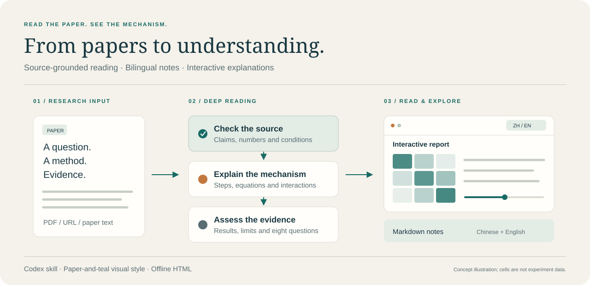
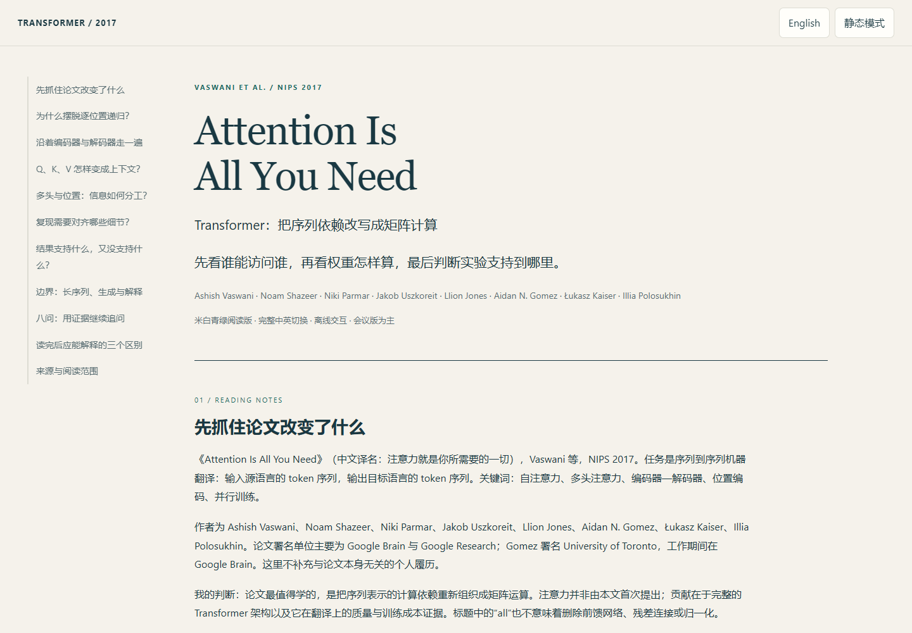
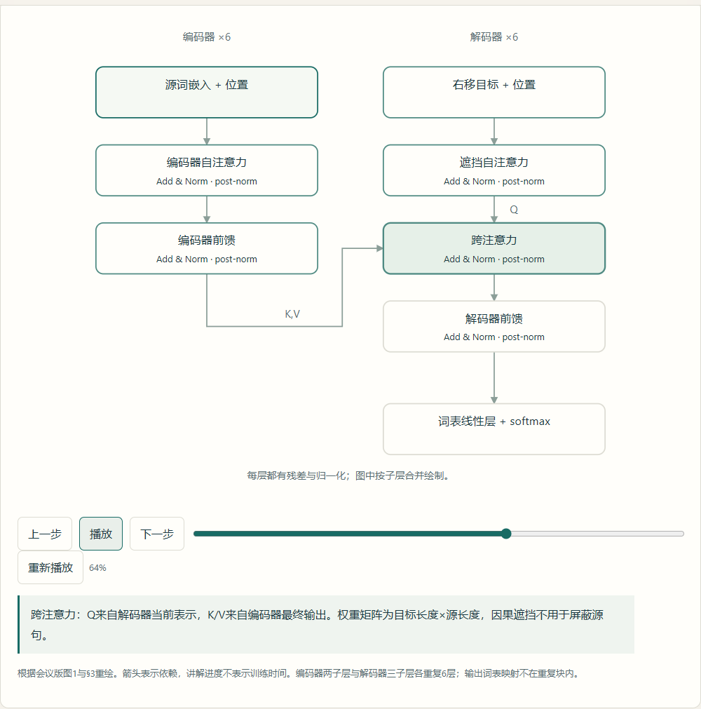
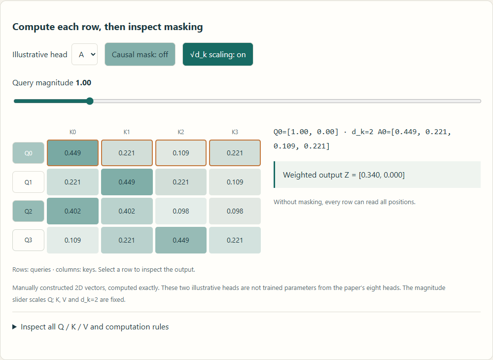
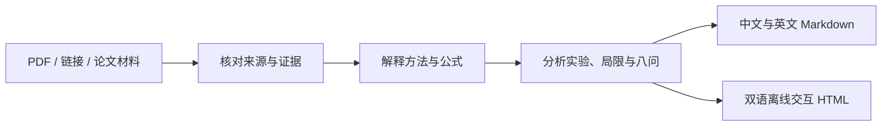

<div align="center">

# Anime Paper Deep Reading

### 读懂论文，也看懂它如何工作。

把学术论文转成有来源、有图解、可探索的阅读体验。  
完整中英双语 · 交互式方法讲解 · 专业 LaTeX · 离线 HTML

[](SKILL.md) [](README.en.md) [](REFERENCE.md#数学排版) [](templates/anime_report_template.html)

**简体中文** · [English](README.en.md)

[功能](#功能) · [效果展示](#效果展示) · [快速开始](#快速开始) · [工作方式](#工作方式) · [贡献](#贡献)

</div>



## 为什么做这个 skill

论文的难点常常藏在公式、模块之间的依赖和实验的比较条件里。一份摘要很难解释这些细节。

**Anime Paper Deep Reading** 是一个面向 Codex 的论文精读 skill：先核对原文，再解释机制，最后评估证据。它把方法做成可以逐步查看的图解，把适合探索的数学关系做成参数交互，同时保留完整的 Markdown，方便研究讨论、笔记归档和再次核查。

视觉沿用米白纸面、青绿主色与铜色重点。正文保持安静，动画用于解释变化；读者可以暂停、拖动步骤，或直接使用静态模式。

## 功能

| 能力 | 阅读时能做什么 |
| --- | --- |
| **完整精读** | 理解背景、问题、贡献、方法、实验与局限，继续追问八个研究问题 |
| **中英双语** | 切换全文、图注与控件语言，保留当前位置、参数和播放状态 |
| **机制图解** | 选择模块、逐步播放或拖动进度，查看输入输出与计算依赖 |
| **参数探索** | 在适合的数学或算法示例中改变参数，观察公式与图形的对应变化 |
| **证据比较** | 切换论文实际报告的配置，查看准确数值、比较条件和来源 |
| **专业数学排版** | 要求 LaTeX 公式实际渲染，支持矩阵、分段函数与多步推导 |
| **离线交付** | 保存双语 Markdown 和自包含 HTML，无需搭建阅读服务 |
| **自然表达** | 用具体机制、数据与适用条件解释判断，减少套话与空泛赞美 |

## 效果展示

以下截图来自此前生成的 Transformer 精读报告，展示阅读布局与交互组件。注意力示例采用手工二维向量，**不是原论文训练模型的权重**；截图生成于新增 LaTeX 规范之前，数学排版以当前规范为准。

### 一张安静的阅读页面

侧边目录组织完整论证，正文保留足够空间，语言与动效开关放在顶部。



### 方法可以一步步看

点击编码器、解码器的模块，查看它的职责与依赖；使用播放、暂停或进度条控制讲解。



### 公式可以动手探索

选择 Query，切换示意头，开关因果遮挡，观察注意力矩阵和加权输出如何变化。



> 交互应服务于当前论文。几何论文可以探索距离；优化论文可以查看算法步骤；理论论文可以展示条件和论证结构。

## 快速开始

### 1. 安装到 Codex

将整个仓库放入用户 skills 目录，文件夹名为 `anime-paper-deep-reading`。默认目录是 `~/.codex/skills`；设置了 `CODEX_HOME` 时，使用其下的 `skills` 目录。

**Windows PowerShell**

```powershell
git clone https://github.com/wellord724/anime-paper-deep-reading.git "$env:USERPROFILE\.codex\skills\anime-paper-deep-reading"
```

**macOS / Linux**

```sh
git clone https://github.com/wellord724/anime-paper-deep-reading.git ~/.codex/skills/anime-paper-deep-reading
```

也可以直接把仓库链接交给 agent，让它完成安装。

这些命令用于目标目录尚不存在时。已有同名 skill 时，请先保留本地修改再更新；私有仓库需要有访问权限的 GitHub 账户。安装后重新载入 skills 或开始新的 Codex 会话。

### 2. 给它一篇论文

附上 PDF、提供链接，或说明准确的论文标题：

```text
$anime-paper-deep-reading 精读 Attention Is All You Need，生成中英文报告和离线交互页面。
```

也可以指定阅读重点：

```text
$anime-paper-deep-reading 精读这篇论文，重点讲清关键公式、消融实验与复现细节。
```

### 3. 阅读与探索

默认输出：

```text
paper_report.zh.md   中文精读笔记
paper_report.en.md   English reading notes
paper_report.html    可切换语言的离线交互报告
```

用浏览器打开 HTML 即可阅读。用户指定单语、篇幅或其他格式时，skill 按需求调整。

## 工作方式



- **来源先行**：区分作者主张、原文证据与读者判断，缺失内容不补造。
- **动画有边界**：示意计算、论文实验与讲解进度明确区分，不用动画制造结果。
- **公式可核查**：专业 LaTeX、统一符号与维度；HTML 实际渲染，数学资源离线自包含。
- **交付可检查**：验证语言切换、参数计算、播放控制、手机布局和离线显示。

这是 **agent 指令与模板包**。论文读取、检索和页面验证由运行它的 agent 工具完成。模板提供可运行的双语交互示例；正式报告需要按论文替换内容，并按数学规范配置离线渲染。

## 项目结构

```text
anime-paper-deep-reading/
├── SKILL.md                           Skill 入口与工作要求
├── REFERENCE.md                       双语、视觉、交互与数学规范
├── EXAMPLES.md                        使用与写作示例
├── agents/
│   └── openai.yaml                    Codex 展示信息与默认提示
├── templates/
│   └── anime_report_template.html     交互视觉基准
└── docs/assets/                       README 示意图与截图
```

## 贡献

欢迎通过 Issue 提供实际使用反馈，或通过 Pull Request 改进指令、模板与示例。描述问题时，附上论文来源、使用需求与可复现的现象；修改图解时，注明哪些关系来自原文，哪些只是教学示意。

特别欢迎：数学渲染、双语术语一致性、移动端与无障碍体验，以及不同学科论文的交互示例。
